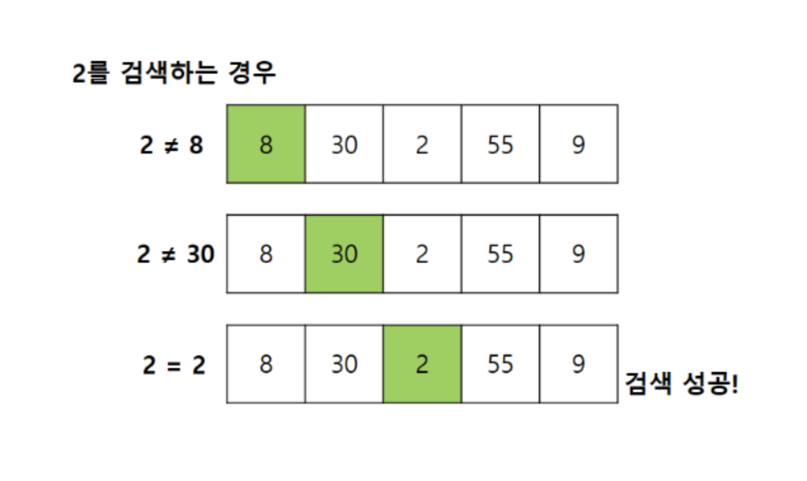
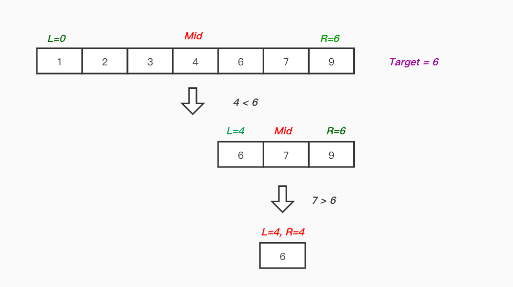

# Binary Search Algorithm (이진 탐색 알고리즘)

✔️ 탐색이란?

: 저장된 데이터 중에 원하는 값을 찾는 문제

---

✔️ 순차 탐색 (Sequential Search) / 선형 탐색 (Linear Search)

: 리스트 안에 있는 특정한 데이터를 찾기 위해 앞에서부터 데이터를 하나씩 `차례대로` 확인하는 방법

- 구현이 단순하지만 비효율적

---

✔️ 이진 탐색 (Binary Search)

: `정렬되어 있는` 자료구조에서 탐색 범위를 `절반`으로 좁혀가며 데이터를 탐색하는 방법

- 시간 복잡도: `O(logN)`, 대용량 데이터에서 특정 데이터를 찾는 데 용이함
- 동작 방식

1. 정렬된 배열에서 중간 인덱스 mid를 찾아, 찾으려는 값 target과 비교
2. target < mid 이면 mid 기준 왼쪽 부분 배열 탐색
3. target > mid 이면 mid 기준 오른쪽 부분 배열 탐색
4. 탐색 범위를 반으로 줄이고, 탐색 범위가 더 이상 없거나 target을 찾을 때까지 반복

___
## 이진 탐색 알고리즘 문제 예시
* 부품 찾기 [https://github.com/dannysmson/codingTestStudy/blob/main/BinarySearch/A.cpp]
* 떡볶이 떡 만들기 [https://github.com/dannysmson/codingTestStudy/blob/main/BinarySearch/B.cpp]
