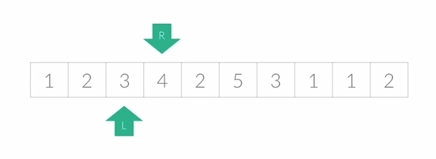

# Two Pointer Algorithm

✔️ 투 포인터 알고리즘

: 1차원 배열에서 각자 다른 원소를 가리키고 있는 `2개의 포인터`를 조작해가면서 원하는 값을 찾을 떄 까지 탐색하는 알고리즘

- 리스트에 순차적으로 접근해야 할 때 두 개의 점의 위치를 기록하면서 처리
- 시간 복잡도: `O(N)`
  

---

## 투 포인터 알고리즘 동작 방식

- 포인트 2개 준비: 보통 `left/right`, `start/end` 명칭
- 조건의 관계: `start <= end`

---

## 투 포인터 예시

- 특정한 합을 가지는 부분 연속 수열 찾기

  - 시작점과 끝점이 첫 번째 원소의 읻덱스를 가리킴
  - 현재 부분의 합이 target과 같다면 카운트
  - 현재 부분의 합이 target보다 작으면 end 1증가
  - 현재 부분의 합이 target보다 크면 start 1증가

- 부분합 <https://github.com/dannysmson/codingTestStudy/blob/main/TwoPointer/1806.cpp>
